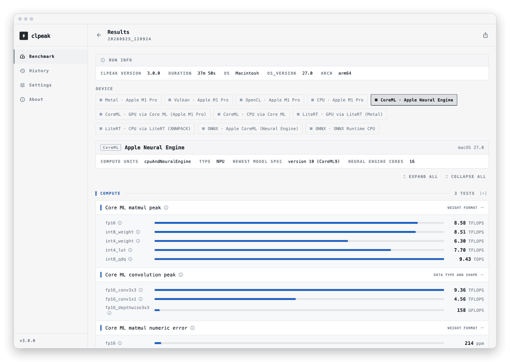

# clpeak

<a href="https://play.google.com/store/apps/details?id=kr.clpeak"></a>
<a href="https://snapcraft.io/clpeak"></a>

[](https://github.com/krrishnarraj/clpeak/releases/latest)
[](https://github.com/krrishnarraj/clpeak/actions/workflows/build.yml)
[](LICENSE)

**clpeak — compute latency peak.** It measures the peak compute throughput,
memory bandwidth and latency that CPUs, GPUs and NPUs actually reach, using
small, tight kernels alongside each vendor's own tuned libraries. It reaches a
device through every API that exposes it and runs the same tests on each, so
the numbers from one machine can be compared side by side.

- **GPU compute APIs:** CUDA, ROCm/HIP, Metal, oneAPI/SYCL, Vulkan, OpenCL
- **AI runtimes (NPU, GPU and CPU):** ONNX Runtime, Core ML, LiteRT
- **CPU:** native kernels, picked per instruction set at run time (x86-64, AArch64)

The same engine ships as a command-line tool and as an app for Windows, macOS,
Linux and Android.

<a href="https://krrishnarraj.github.io/clpeak/">
<picture>
  <source media="(prefers-color-scheme: dark)" srcset="docs/assets/img/results-npu-dark.png">
  
</picture>
</a>

## Sample output

Condensed from the saved runs in [`results/`](results/).

```text
$ clpeak --cuda
Backend: CUDA
  Device 0: NVIDIA GeForce RTX 5060
    Tensor cores (WMMA / mma.sync)
      fp16     : 42.6 TFLOPS
      fp8_e4m3 : 85.2 TFLOPS
      nvf4_e2m1 : 328 TFLOPS
      int8     : 84.7 TOPS
    cuBLASLt GEMM peak
      fp16     : 79.1 TFLOPS
      nvf4_e2m1 : 301 TFLOPS
    Global memory bandwidth
      float4   : 420 GB/s
    Kernel launch latency
      roundtrip : 6.68 us
```

```text
$ clpeak --devices coreml:0
Backend: CoreML
  Device 0: Apple Neural Engine
    Core ML matmul peak
      fp16     : 8.58 TFLOPS
      int4_lut : 7.70 TFLOPS
      int8_qdq : 9.43 TOPS
    Transformer block, prefill
      fp16_s512 : 4.95 TFLOPS
    Transformer block, decode
      fp16_kv2048 : 43.3 GB/s
    Core ML dispatch latency
      trivial_op : 769 us
```

More screenshots are on the [project page](https://krrishnarraj.github.io/clpeak/).

## Build

```sh
git clone --recursive https://github.com/krrishnarraj/clpeak
cd clpeak
cmake -S . -B build
cmake --build build -j
./build/clpeak
```

A backend is built when its SDK is found, and `-DCLPEAK_ENABLE_<BACKEND>=OFF`
leaves it out. The ONNX Runtime and LiteRT backends need no SDK: their
runtimes are loaded when clpeak runs. The desktop app is built alongside the
CLI when the Flutter SDK is on `PATH`, into `build/clpeak-gui/`. The
[project page](https://krrishnarraj.github.io/clpeak/#build) lists every
option; Android and iOS builds are in [`app/AGENTS.md`](app/AGENTS.md).

## Usage

```sh
clpeak                            # every test on every device
clpeak --list-devices             # what clpeak can see, named as --devices takes them
clpeak --devices cuda:0,vulkan:1  # only these devices
clpeak --vulkan --opencl          # only these backends
clpeak --bandwidth                # one category: --compute, --bandwidth, --latency, --ai, …
clpeak --gemm                     # one test, on every backend that has it
clpeak --describe                 # what each test and each reading measures
clpeak -o run.clpeak.json         # save the run as JSON
clpeak --compare run.clpeak.json  # run again and compare with a saved run
```

`clpeak --help` lists every flag. `--onnx-lib` and `--litert-lib` choose
which ONNX Runtime or LiteRT library to load.

## Running the release binaries

Each [release](https://github.com/krrishnarraj/clpeak/releases/latest) has a
zip per platform with the CLI and the app, plus `cuda`, `rocm` and `oneapi`
variants that add those backends, and a `.dmg` of the macOS app. The binaries
aren't signed with a developer certificate, so the OS asks before running them
the first time.

**Windows:** before extracting, right-click the zip → **Properties** → tick
**Unblock** → **OK**. If SmartScreen still says "Windows protected your PC",
choose **More info** → **Run anyway**.

**macOS:** open the `.dmg` and drag clpeak to Applications. The first launch
is refused; open **System Settings** → **Privacy & Security** and click
**Open Anyway** next to clpeak. Or clear the quarantine flag from a terminal,
which also works for the CLI from the zip:

```sh
xattr -dr com.apple.quarantine /Applications/clpeak-gui.app
xattr -dr com.apple.quarantine ~/Downloads/clpeak-*-macos-arm64
```

**Linux:** `sudo snap install clpeak --classic`, or use the zip as it is.

**Android:** [Google Play](https://play.google.com/store/apps/details?id=kr.clpeak).

## Reporting a bug

Numbers that look wrong, missing devices and crashes are all worth reporting.
Attach a verbose run so the report can be debugged without your machine.

- **CLI:** run `clpeak --verbose -o report.clpeak.json` and attach
  `report.clpeak.json`. If clpeak crashed before finishing, attach
  `report.clpeak.log` from the same folder instead: it is written as the run
  goes.
- **App:** turn on **Settings** → **Diagnostics** → **Verbose diagnostics**,
  run again, then use **Export JSON** on the results page. A run the app did
  not survive is listed in **History** under "Runs that did not finish", with
  its own export.

Then [open an issue](https://github.com/krrishnarraj/clpeak/issues/new/choose)
and add the file to it.

## For AI agents

The tree is documented for coding agents with `AGENTS.md` files. Start at the
[root `AGENTS.md`](AGENTS.md) for the architecture, the directory map and the
conventions for adding a benchmark or a backend; a subdirectory's own
`AGENTS.md` covers the code in it. Saved runs in [`results/`](results/) are
the baselines to check a suspicious number against, and [`NOTES.md`](NOTES.md)
lists the workarounds for runtime bugs that are waiting on an upstream fix.
