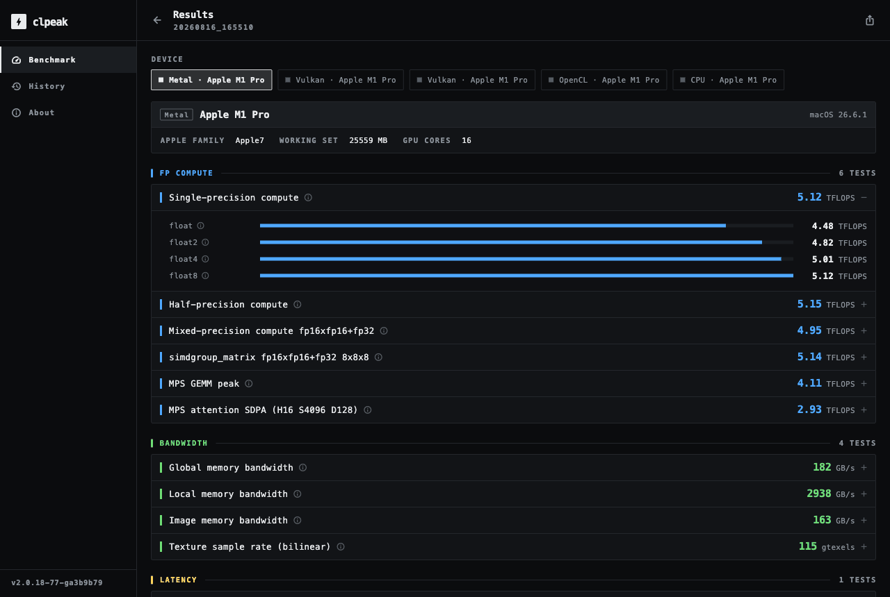

# clpeak

<a href="https://play.google.com/store/apps/details?id=kr.clpeak"></a>
<a href="https://snapcraft.io/clpeak"></a>

[](https://github.com/krrishnarraj/clpeak/actions/workflows/build.yml)

**clpeak &mdash; "Compute Latency PEAK".** A synthetic micro-benchmark for measuring the peak achievable compute performance of CPUs and GPUs. It exercises tight vector, MAD, and MMA kernels, together with vendor-optimized GEMM libraries, to expose peak hardware throughput.

Originally an OpenCL benchmark, clpeak now supports OpenCL, Vulkan, CUDA, ROCm/HIP, Metal, oneAPI/SYCL, and native CPU execution, enabling direct cross-backend comparisons on the same hardware.

[](https://krrishnarraj.github.io/clpeak/)

## Sample output

Condensed peak-revealing lines from real runs.

Apple M1 Pro, Metal backend:

```text
Backend: Metal
  Device 0: Apple M1 Pro

    Single-precision compute
      float    : 4.49 TFLOPS
      half     : 4.99 TFLOPS

    simdgroup_matrix fp16xfp16+fp32 8x8x8
      simdgroup_fp16 : 5.14 TFLOPS

    MPS GEMM peak
      fp32     : 4.09 TFLOPS
      fp16     : 3.97 TFLOPS

    Global memory bandwidth
      float    : 184 GB/s
```

NVIDIA RTX 5060, CUDA backend:

```text
Backend: CUDA
  Device 0: NVIDIA GeForce RTX 5060

    Single-precision compute
      float    : 21.1 TFLOPS
      half     : 21.1 TFLOPS
      bf16     : 20.0 TFLOPS

    FP16 mma.sync m16n8k16+fp16
      fp16_f16acc : 83.4 TFLOPS

    FP8(E4M3) mma.sync m16n8k32+fp16
      fp8_e4m3_f16acc : 167 TFLOPS

    FP8(E4M3) mma.sp 2:4 sparsity m16n8k64+fp32
      fp8_sparse : 170 TFLOPS

    FP8(E4M3) mma.sp 2:4 sparsity m16n8k64+fp16
      fp8_sparse_f16acc : 326 TFLOPS

    INT8 mma.sync m16n8k32+int32
      int8_k32 : 165 TOPS

    INT8 mma.sp 2:4 sparsity m16n8k64+int32
      int8_sparse : 327 TOPS

    MXFP4(E2M1) mma.sync m16n8k64+fp32
      mxf4_e2m1 : 325 TFLOPS

    NVFP4(E2M1) mma.sync m16n8k64+fp32
      nvf4_e2m1 : 327 TFLOPS

    MXFP4 mma.sp 2:4 sparsity m16n8k128+fp32
      mxf4_sparse : 630 TFLOPS

    NVFP4 mma.sp 2:4 sparsity m16n8k128+fp32
      nvf4_sparse : 630 TFLOPS

    INT8 dot-product compute (__dp4a)
      int8_dp8 : 41.7 TOPS

    cuBLASLt GEMM peak
      fp16     : 77.5 TFLOPS
      bf16     : 41.1 TFLOPS
      fp8_e4m3 : 144 TFLOPS
      nvf4_e2m1 : 299 TFLOPS
      int8     : 149 TOPS

    Global memory bandwidth
      float4   : 419 GB/s

    Kernel launch latency
      roundtrip : 6.24 µs
```

AMD Instinct MI300X, ROCm backend:

```text
Backend: ROCm
  Device 0: AMD Instinct MI300X

    Single-precision compute
      float    : 135 TFLOPS
      half     : 151 TFLOPS
      double   : 62.9 TFLOPS
      bf16     : 117 TFLOPS

    MFMA fp16xfp16+fp32 16x16x16
      mfma_fp16 : 1.13 TFLOPS

    MFMA bf16xbf16+fp32 16x16x16
      mfma_bf16 : 1.12 TFLOPS

    MFMA fp8xfp8+fp32 16x16x32
      mfma_fp8 : 2.17 TFLOPS

    MFMA int8xint8+int32 16x16x32
      mfma_int8 : 2.34 TOPS

    Sparse MFMA fp16 2:4 16x16x32
      smfmac_fp16 : 2.15 TFLOPS

    Sparse MFMA fp8 2:4 16x16x64
      smfmac_fp8 : 4.14 TFLOPS

    Sparse MFMA int8 2:4 16x16x64
      smfmac_int8 : 4.50 TOPS

    rocBLAS GEMM peak
      fp32     : 130 TFLOPS
      fp64     : 100 TFLOPS
      fp16     : 840 TFLOPS

    hipBLASLt FP8 GEMM peak
      fp8_e4m3 : 1.59 TFLOPS

    Global memory bandwidth
      float4   : 3.58 TB/s

    Kernel launch latency
      roundtrip : 8.66 µs
```

## Desktop app

Same benchmark engine as the CLI, with device detection, live-streaming results, and a saved run history — one app for **macOS, Linux, and Windows** (built from the same Flutter codebase as the Android and iOS apps, over the `clpeak_ffi` C ABI).

Easiest way to get numbers off a machine, no command line involved:

1. Grab the archive for your platform from the [latest release](https://github.com/krrishnarraj/clpeak/releases/latest)
2. Launch it and press **Run**. Every detected device on every available backend is benchmarked, and results stream in as they land.
3. **Custom…** narrows the run to specific devices, test categories, and per-test time budgets. Each run is saved to History and exports as clpeak's XML.

## Building

```console
git submodule update --init --recursive --remote
cmake -S . -B build
cmake --build build -j
./build/clpeak
```

Optional backends are auto-detected and enabled when their SDK is found. To opt out of a backend at configure time:

```console
cmake -S . -B build -DCLPEAK_ENABLE_CUDA=OFF
cmake -S . -B build -DCLPEAK_ENABLE_VULKAN=OFF -DCLPEAK_ENABLE_METAL=OFF
cmake -S . -B build -DCLPEAK_ENABLE_ONEAPI=ON -DCMAKE_CXX_COMPILER=icpx
```

> **oneAPI/SYCL note:** the oneAPI backend needs `-DCMAKE_CXX_COMPILER=icpx` (the DPC++ compiler); SYCL kernels compile inline, so any other compiler silently skips the backend.

| CMake option | Default | Effect when `OFF` |
|---|---|---|
| `CLPEAK_ENABLE_OPENCL` | `ON` | Skip OpenCL backend |
| `CLPEAK_ENABLE_VULKAN` | `ON` | Skip Vulkan even if Vulkan SDK is present |
| `CLPEAK_ENABLE_CUDA` | `ON` | Skip CUDA even if CUDA Toolkit is present |
| `CLPEAK_ENABLE_ROCM` | `ON` | Skip ROCm/HIP even if ROCm SDK is present |
| `CLPEAK_ENABLE_METAL` | `ON` | Skip Metal/MPS even on Apple silicon |
| `CLPEAK_ENABLE_ONEAPI` | `ON` | Skip oneAPI/SYCL |
| `CLPEAK_ENABLE_CPU` | `ON` | Skip native CPU backend (no SDK; otherwise always available) |
| `CLPEAK_ENABLE_GUI` | `ON` | Skip the `clpeak-gui` desktop app (also skipped automatically when no Flutter SDK is found) |

The desktop app is built along with the CLI whenever the Flutter SDK is on `PATH`, landing as a complete bundle in `build/clpeak-gui/`

```console
cmake --build build --target clpeak-gui       # app bundle
```

## CLI

`./clpeak --help` prints the full flag list. The CLI is uniform across backends: the same global, test-selection, and output flags work whether OpenCL, Vulkan, CUDA, ROCm/HIP, Metal, oneAPI/SYCL, or CPU is doing the work.

```console
./clpeak                              # run every test on every available backend
./clpeak --single-precision-compute   # run only single-precision compute, on every backend
./clpeak --metal                      # run only one backend
./clpeak --cuda --vulkan              # combine multiple --<backend> flags
./clpeak --rocm                       # run only the ROCm/HIP backend
./clpeak --oneapi                     # run only the oneAPI/SYCL backend
./clpeak --cpu                        # run only the native CPU backend
./clpeak --no-opencl --no-cuda        # or skip the ones you don't want
./clpeak --wmma                       # CUDA tensor-core tests (hand-rolled WMMA)
./clpeak --cublas                     # CUDA vendor-SDK GEMM peak (cuBLASLt, all dtypes)
./clpeak --rocwmma                    # AMD matrix-engine tests (hand-rolled rocWMMA)
./clpeak --mfma                       # AMD raw MFMA matrix-core peak (fp16/bf16/int8/fp8/mxfp4) + 2:4 sparse (smfmac)
./clpeak --rocblas                    # AMD vendor-SDK GEMM peak (rocBLAS fp32/fp64/fp16 + hipBLASLt fp8)
./clpeak --simdgroup-matrix           # Apple matrix-engine tests (hand-rolled simdgroup_matrix)
./clpeak --mps-gemm                   # Apple vendor-SDK GEMM peak (MPS / MPSGraph)
./clpeak --joint-matrix               # Intel XMX matrix-engine tests (hand-rolled joint_matrix)
./clpeak --onemkl                     # Intel vendor-SDK GEMM peak (oneMKL)
./clpeak --amx                        # CPU matrix-engine tests (AMX / SMMLA / BFMMLA)
./clpeak --crypto                     # CPU crypto/hash silicon in GB/s (AES, SHA-256/512, CRC32-C)
./clpeak --divide-sqrt-compute        # CPU divider/sqrt-unit throughput (fp32/fp64)
./clpeak --atomics --branch-penalty   # CPU sync + branch-mispredict cost probes (ns)
./clpeak --coopmat                    # Vulkan tensor-core tests
./clpeak --describe                   # explain what each test and reading measures
./clpeak -o out.clpeak.json           # save results (one JSON document)
./clpeak --compare baseline.clpeak.json   # diff this run against a saved baseline
./clpeak --list-devices               # enumerate devices for every backend, no benchmarks
```

`--compare baseline.clpeak.json` re-runs the selected tests and prints each result next to the value saved earlier with `-o`, saying whether the change was better or worse for that reading — so a latency regression reads as one, not as a cheerful `+3%`.

### Selecting a specific device

Multi-GPU machines pick devices per-backend. Each index flag takes one index or
a comma-separated list; omitting it runs every device in that backend:

```console
./clpeak --cl-platform 0 --cl-device 1   # OpenCL platform/device pair
./clpeak --vk-device 0,1                 # Vulkan physical-device indices (subset)
./clpeak --cuda-device 0,2               # CUDA device ordinals
./clpeak --rocm-device 0                 # ROCm/HIP device ordinal
./clpeak --mtl-device 0                  # Metal device index
./clpeak --oneapi-device 0               # oneAPI/SYCL device index
```

The CPU backend is a single device with no index flag. Use `--no-cpu` to skip it.

## For AI agents

This tree is documented with `AGENTS.md` files. Start at the
[root `AGENTS.md`](AGENTS.md) for architecture, directory map, build
instructions, and the self-maintaining documentation conventions.
Every subdirectory has its own `AGENTS.md` with local details — open
the one closest to the code you're touching.
